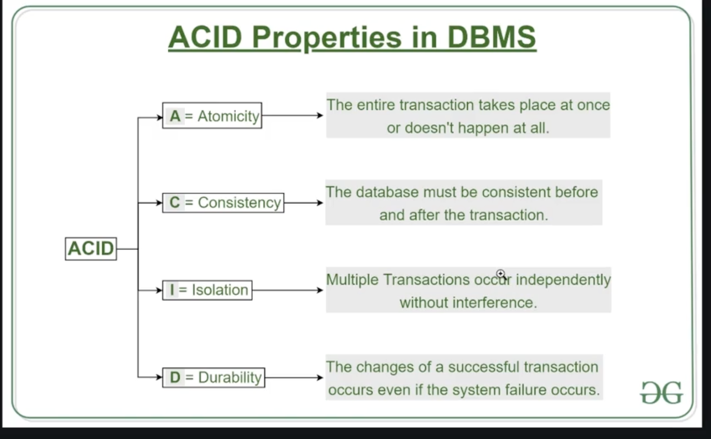

## ACID

- 
-

## NextJS

- (dashboard)--> It means the components within this will share defined components, It also doesn't comes in the URI too
-

## MongoDB

- If any query in transaction gets modified then mongoDB automatically rollback the changes whereas in postgres don't that's why we need locking in postgres.
- Read/ Write Locks
